# are-you-ok

[](https://linux.do/u/zzzz/activity)

> Instant status snapshots for Claude Code — auto-recovers after network drops, and Lei Jun sings 🎤

**[中文 →](README.md)**

---

## ✨ What It Does

👌 Say `are you ok` — instant snapshot of model, tasks, git, and memory  
🔄 Auto-recovers from network drops — detects error signals and guides you back, no input needed  
⚡ Inline peek — append a status summary to any response with `?`, without breaking your flow  
🎵 Lei Jun sings — say `雷总唱歌给我听` and he'll sing Are You OK for you  

---

## Preview



**Agent mode** (`are you ok`):
```
👌  STATUS ─── 2026-06-06 14:32
│
│  agent    claude-sonnet-4-6
│  cwd      ~/projects/my-app
│  git      main · 2Δ · "feat: add user search"
│  memory   4 entries
│  tasks    ●2 active  ○1 pending  ✓3 done
│  tools    Read Write Edit Glob Grep
│
├─ ACTIVE ───────────────────────────────────────
│  ●  implement pagination for the results list
│  ●  write unit tests for the auth module
├─ PENDING ──────────────────────────────────────
│  ○  update API documentation
├─ MEMORY ───────────────────────────────────────
│  project-alpha   backend migration goals
╰────────────────────────────────────────────────
```

**Project mode** (`project status`):
```
👌  PROJECT STATUS ─── 2026-06-06 14:32
│
│  project  my-app  [Node.js]
│  version  v1.2.0
│  cwd      ~/projects/my-app
│  git      main · 3Δ · "feat: add user search"
│  memory   4 entries
│  tasks    ●2 active  ○3 pending  ✓8 done
│  agent    claude-sonnet-4-6
│
├─ PROJECT BRIEF ────────────────────────────────
│  Full-stack Node.js app, RESTful API + React frontend
├─ RECENT COMMITS ───────────────────────────────
│  a1b2c3d  feat: add user search
│  e4f5g6h  fix: login redirect issue
├─ ACTIVE ───────────────────────────────────────
│  ●  implement pagination for the results list
├─ RECENT CHANGES ───────────────────────────────
│  src/components/SearchBar.tsx
├─ MEMORY ───────────────────────────────────────
│  project-alpha   backend migration goals
╰────────────────────────────────────────────────
```

---

## Quick Start

**Windows (PowerShell):**
```powershell
irm https://raw.githubusercontent.com/C-QY/are-you-ok/master/install.ps1 | iex
```

**Mac / Linux:**
```bash
curl -fsSL https://raw.githubusercontent.com/C-QY/are-you-ok/master/install.sh | bash
```

Restart Claude Code, then say `are you ok`. Run the same command again to update.

<details>
<summary>Manual install</summary>

```bash
git clone https://github.com/C-QY/are-you-ok ~/.claude/skills/are-you-ok
chmod +x ~/.claude/skills/are-you-ok/scripts/status-check.sh  # Mac/Linux
```
</details>

---

## Trigger Reference

| Trigger | Mode | Output |
|---------|------|--------|
| `are you ok` · `status check` · `report status` | Agent status | Model, tasks, git, memory |
| `project status` · `project progress` | Project status | Version, commits, changed files |
| `?` · `??` · `???` | Inline peek | Answers first, appends status at end |
| Network error signal (auto) | Network recovery | Disconnect summary + recovery steps |
| `hello` / `thank you` / `thank you very much` | Easter egg | Silent audio + text box |
| `雷总唱歌给我听` | Super easter egg | Full 18s audio + text box |

Programmatic: `!status` or `{"skill":"are-you-ok","mode":"agent|project"}`

---

## Hidden Touches 🎵

All audio plays silently in the background — no player window, no interruption.

| Trigger | File | Duration |
|---------|------|----------|
| `are you ok` | `eleijun-are-you-ok.mp3` | ~2s |
| `hello` / `thank you` / `thank you very much` (any one) | `eleijun-hello.mp3` | ~3.7s |
| `雷总唱歌给我听` | `eleijun-super.mp3` | ~18s |

On trigger:
```
╭──────────────────────────────────╮
│     🎤  "Hello~ Thank you~"      │
│      "Thank you very much!"      │
│              Friday              │
│           2026-06-06             │
╰──────────────────────────────────╯
```

Audio files are not bundled (copyright) — drop them into `assets/` and they play automatically. Missing files fall back to text-only gracefully.

> Source: search "雷军 are you ok" on Bilibili, trim the clips, encode at 64 kbps mono.

**Silence audio:** Create an empty `.no-audio` file in `assets/` — audio skips silently, text boxes still show.

```bash
touch ~/.claude/skills/are-you-ok/assets/.no-audio
```

---

## Network Recovery

Auto-triggers when network error signals appear in context — no input needed:

```
👌  NETWORK RECOVERY ─── 2026-06-06 10:30
│
│  network  ✓ restored
│  git      2Δ uncommitted  ·  "feat: add user search"
│  tasks    ●1 active  ○2 pending
│
├─ RECOVERY STEPS ───────────────────────────────
│  1. Identify the interrupted tool call / operation
│  2. Verify actual state with read-only ops first (Read/Grep)
│  3. Check background jobs — still running or hung?
│  4. Confirm state before resuming any writes
╰────────────────────────────────────────────────
```

Detects signals from: Claude Code · ChatGPT · GitHub Copilot · Cursor · Gemini · universal signals (ECONNRESET / 502 / 503 etc.)

---

## Design Principles

**Fast · Lightweight · Universal** — scripts collect metadata only, never file content.

| Layer | File | Token cost |
|-------|------|-----------|
| L1 | `SKILL.md` frontmatter | ~100 tokens |
| L2 | `SKILL.md` body | Loaded on trigger |
| L3 | `scripts/status-check.*` | Executed, not read — zero token cost |

---

## Requirements

| Platform | Requirement |
|----------|-------------|
| Windows | PowerShell 5.1+ |
| Mac | bash · afplay (built-in) |
| Linux | bash · mpg123 or ffplay (optional, for audio) |
| All platforms | `git` (optional) |
